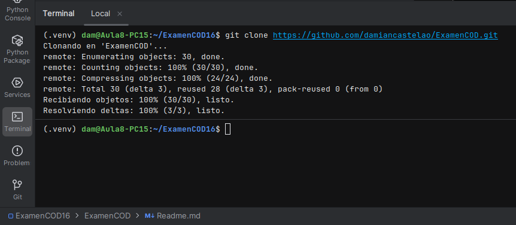
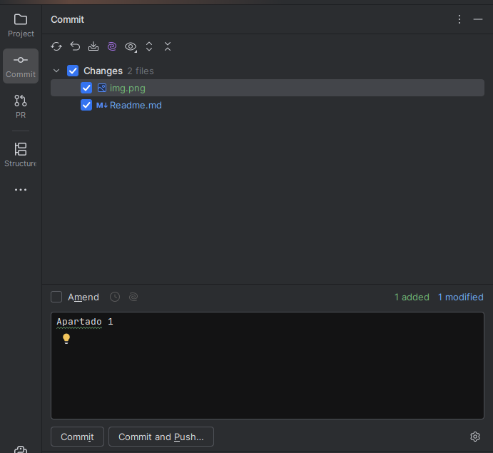
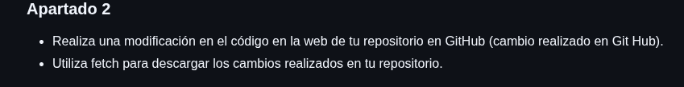
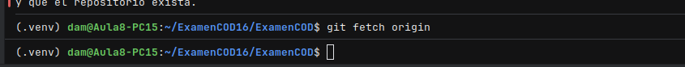

# Examen 1ª Evaluación (2ª Parte) - Control de Versiones  
Martín Pereira Fernández
---

## Instrucciones
- Los commits de cada apartado deben tener el mensaje *"Apartado X - descripción del cambio realizado"*
- Entrega en la tarea de Moodle tu repositorio
- Solo se corrigen los commits que estén en el repositorio remoto

### Apartado 1

- Clona este repositorio.  
Para ello debemos de copiar el anlace del repositorio que queremos clonar, acto siguiente haremos un git clone (enlace) en la terminal de PyCharm.  

- Modifica este Readme, poniendo tu nombre completo, realiza un `commit` con el mensaje *"Apartado 1"* y un `push`.  
Tras poner el nombre haremos un commit and push añadiendo el texto "Apartado 1" dentro del commit.  

Pregunta 
- ¿Qué paso es fundamental cuando clonamos un repositorio ajeno para que podamos subir nuestros propios commits? Explícalo y utiliza capturas de pantalla.  
El paso fundamental para poder tener el clon es hacer el git clone dentro de la terminal de PyCharm.  

### Apartado 2

- Realiza una modificación en el código en la web de tu repositorio en GitHub  
Realizamos el cambio desde Git Hub haciendo un commit, este sería el cambio realizado:  

- Utiliza fetch para descargar los cambios realizados en tu repositorio.  
Para ello haremos git fetch origin en la terminal de PyCharm con lo que se hará el commit ya hecho desde Git Hub.  

Pregunta
- Explica los pasos para que el código modificado en GitHub, llegue a tu rama principal local. Explícalo con capturas de pantalla.

### Apartado 3

- Realiza otro cambio desde la web de tu repositorio en GitHub.
- Utiliza pull para descargar los cambios realizados en tu repositorio.

Pregunta
- Explica los pasos dados para que el cambio realizado en GitHub, llegue a tu rama principal local. Explícalo con capturas de pantalla.

